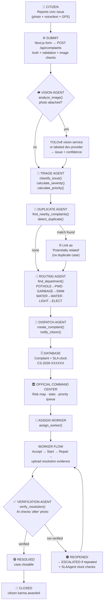
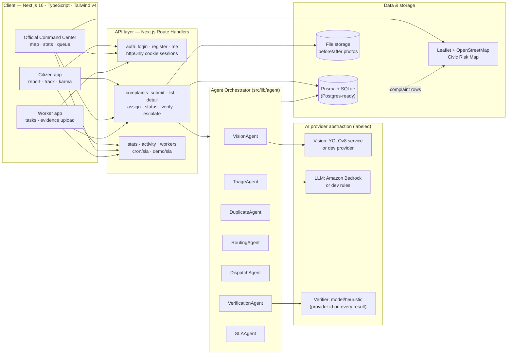
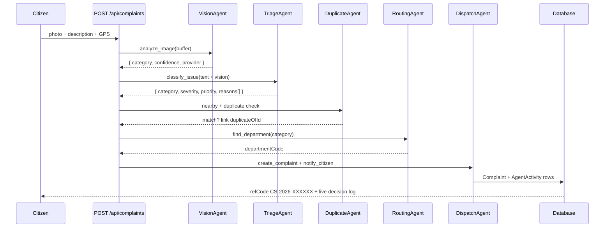

# CivicShield AI — Flow & Block Diagrams (PPT-ready)

Everything below is generated from the real codebase (`src/lib/agent/orchestrator.ts`,
`prisma/schema.prisma`, API routes). Mermaid blocks render directly in mermaid.live,
Notion, or GitHub; ASCII versions paste anywhere (PowerPoint text boxes included).

---

## 1. MASTER FLOW DIAGRAM (full user journey)

### Mermaid (paste into https://mermaid.live → export PNG for the slide)



### ASCII version (paste anywhere)

```
CITIZEN (photo + voice/text + GPS)
        │
        ▼
SUBMIT ── POST /api/complaints ── auth + validation + image checks
        │
        ▼
VISION AGENT ── analyze_image()          (only if photo attached)
        │        YOLOv8 service / labeled dev provider
        ▼
TRIAGE AGENT ── classify_issue() → category
        │        calculate_severity() → LOW/MED/HIGH/CRITICAL
        │        calculate_priority() → score 1–100 (explainable)
        ▼
DUPLICATE AGENT ── find_nearby_complaints() + detect_duplicate()
        │            match → link "potentially related", no new case
        ▼
ROUTING AGENT ── find_department()
        │          POTHOLE→PWD  GARBAGE→SWM  WATER→WATER  STREETLIGHT→ELECT
        ▼
DISPATCH AGENT ── create_complaint() + notify_citizen()
        │           SLA clock starts (12/24/48/72h by severity)
        ▼
DATABASE (Complaint · TimelineEvent · AgentActivity · Escalation)
        │
        ▼
OFFICIAL COMMAND CENTER ── risk map + stats + priority queue
        │
        ▼
ASSIGN WORKER
        │
        ▼
WORKER: Accept → Start work → repair → upload after-photo
        │
        ▼
VERIFICATION AGENT ── verify_resolution()
        │
   ┌────┴─────────┐
   ▼              ▼
VERIFIED       NOT VERIFIED
   │              │
RESOLVED       REOPENED → ESCALATED → back to worker
   │
CLOSED (+ citizen karma)
```

---

## 2. SYSTEM BLOCK DIAGRAM (architecture layers)

### Mermaid



### ASCII version

```
┌──────────────────────── CLIENT (Next.js 16 + TS + Tailwind) ───────────────────────┐
│  Citizen app          Official Command Center           Worker app                 │
│  report/track/karma   risk map · stats · queue          tasks · evidence upload    │
└──────────┬──────────────────────┬──────────────────────────────┬────────────────────┘
           │  fetch (httpOnly-cookie auth, JSON)                                      │
┌──────────▼──────────────────────▼──────────────────────────────▼────────────────────┐
│                          API LAYER (Next.js Route Handlers)                          │
│  /api/auth/*   /api/complaints[/id][/assign|status|verify|escalate]                  │
│  /api/stats    /api/activity    /api/official/workers    /api/cron/sla  /api/demo/sla│
└──────────┬───────────────────────────────────────────────────────────────────────────┘
           │
┌──────────▼───────────────── AGENT ORCHESTRATOR ────────────────────────────────────┐
│  VisionAgent → TriageAgent → DuplicateAgent → RoutingAgent → DispatchAgent          │
│                        VerificationAgent · SLAAgent (later in lifecycle)            │
│  every decision persisted to AgentActivity (public decision log)                    │
└──┬──────────────┬──────────────┬──────────────────┬────────────────────────────────┘
   │              │              │                  │
┌──▼───┐     ┌────▼────┐   ┌─────▼──────┐    ┌──────▼───────┐      AI PROVIDERS
│Vision│     │   LLM   │   │ Duplicate  │    │ Verifier     │      (always labeled)
│YOLO/ │     │Bedrock/ │   │ Haversine+ │    │ model /      │
│dev   │     │dev rules│   │ Jaccard    │    │ heuristic    │
└──────┘     └─────────┘   └────────────┘    └──────────────┘
   │              │              │                  │
┌──▼──────────────▼──────────────▼──────────────────▼─────────────────────────────────┐
│  DATA: Prisma + SQLite (Postgres-ready) · file storage · Leaflet + OpenStreetMap     │
│  Models: User · Department · Complaint · TimelineEvent · AgentActivity · Escalation  │
└─────────────────────────────────────────────────────────────────────────────────────┘
```

---

## 3. AGENT PIPELINE DETAIL (per-report sequence)



---

## 4. COMPLAINT LIFECYCLE (state machine)

```
RECEIVED ──assign──► ASSIGNED ──accept/start──► IN_PROGRESS
    │                                             │
    │                                    upload evidence
    │                                             ▼
    │                                        VERIFICATION
    │                                    ┌───────┴────────┐
    │                              verified          not verified
    │                                    ▼                ▼
    │                                RESOLVED ◄────  REOPENED ──► ESCALATED
    │                                    │              (back to worker)  │
    └── overdue SLA ──► OVERDUE ──► ESCALATED ◄───────────────────────────┘
                                         │
                                      CLOSED (+ karma)
```

## 5. SLA RULES (configurable via env)

| Severity | SLA hours | Escalation on breach |
|----------|-----------|----------------------|
| CRITICAL | 12        | overdue sweep → Escalation L1+ |
| HIGH     | 24        | ↑ |
| MEDIUM   | 48        | ↑ |
| LOW      | 72        | ↑ |

## 6. ROUTING TABLE (actual `CATEGORY_DEPARTMENT` map)

| Category | Department |
|----------|------------|
| POTHOLE, ROAD_DAMAGE | PWD — Public Works |
| GARBAGE, WASTE_OVERFLOW | SWM — Solid Waste Mgmt |
| WATERLOGGING | WATER — Water Dept |
| STREETLIGHT | ELECT — Electrical |
| OTHER | GEN — General Municipal |

---

### PPT drawing tips
- Mermaid → PNG: paste each block at mermaid.live, set theme "dark", export at 2x.
- PowerPoint: Insert → Icons for the agent emojis; keep one agent per box, arrows top-to-bottom.
- Colors already used in the app: navy #07111F · surface #0D1B2A · blue #2563EB ·
  emerald #10B981 · amber #F59E0B · red #EF4444 — reuse them for a matching deck.
